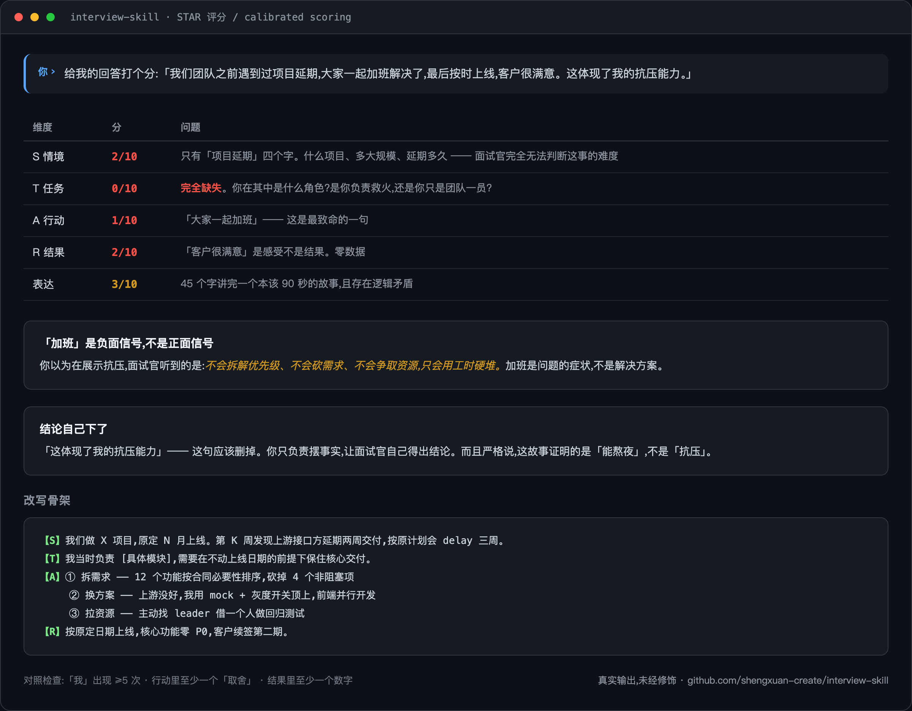

<div align="center">

# interview-skill

> Interview prep that **won't invent company facts, scores your STAR answers against anchors,
> strips the AI tell from your prepared lines, and preps you for AI-interviewer rounds.**
> For the candidate, not the hiring side. Bilingual EN / 中文.

[](LICENSE)
[](CHANGELOG.md)
[](https://python.org)
[](https://claude.ai/code)
[](https://agentskills.io)

[**中文**](README.md) · [Install](INSTALL.md) · [Changelog](CHANGELOG.md) · [Architecture](docs/ARCHITECTURE.md)

</div>

<div align="center">
  
  <sub>Real output, unedited. One scoring pass: per-dimension marks → the problem you couldn't see → a rewrite skeleton. (Demo is in Chinese; the skill follows your language.)</sub>
</div>

---

## Why not just ask the model directly

**Models invent company facts.** Ask "what does Company X ask in their backend interview" and you get a clean list. Some of it is real; some is a plausible average of every backend interview on the internet. You can't tell which — but you're the one walking into the room with it. Here every fact in a company brief carries a source and a confidence label (HIGH / MEDIUM / LOW / GAP). If nothing confirms it, it says GAP and tells you to ask the recruiter. A brief with 60% coverage you can trust beats one with 100% coverage you can't.

**Scoring drifts.** Without anchors, a scoring pass turns into an all-4s comfort session or an all-2s beatdown depending on what it saw first. This one reads two anchored examples (a 4-point and a 2-point answer) before scoring, then checks the distribution afterward — six answers landing on the same score means the scale broke, so it re-scores.

**Interviewers can hear AI now.** Rule-of-three phrasing, a "this demonstrates my X" tag at the end of every paragraph, a flawless-hero narrative. A "perfect" answer that reads as AI-written costs you more than a plain honest one. Generated reference answers go through a de-AI pass before you see them.

**AI-interviewer rounds are a different game.** Async video screens give you 90 seconds per question and weight the first 15 heaviest; some companies ban Copilot in live coding while others expect you to use it. Both cases have their own playbook here.

## What's new in v2.0

- **AI-era interviews**: async-video/AI-screener strategies, both camps of live-coding AI policy, 15 new AI-role questions
- **Evidence discipline**: company briefs only register facts appearing verbatim at the source; gaps are labeled, never fabricated
- **Calibrated scoring**: STAR scoring ships with 4-point and 2-point anchor answers
- **Humanized answers**: every reference answer passes an 8-item de-AI checklist before delivery
- **Slim architecture**: SKILL.md 1616 → ~110-line router with progressive disclosure; new AGENTS.md for Codex/Cursor
- See [CHANGELOG.md](CHANGELOG.md)

## How It Compares to Manual Prep

| | Manual | interview-skill |
|---|---|---|
| Search | One query at a time | 5 dimensions × 3 queries = 15 targeted searches |
| Results | 10 links, read them yourself | Auto-scored and filtered, only high-quality data kept |
| Analysis | Summarize it yourself | Statistical cross-validation across 15+ sources with confidence labels |
| Questions | Generic interview questions | Tailored to the company + role + round |
| Practice | No feedback loop | AI plays the interviewer in that company's style, with follow-ups |

## Features

- **4-Layer Research Engine** — Multi-dimensional search → Score & filter → Cross-validate → User supplement
- **Structured Interview Analysis** — Statistical analysis across multiple interview reports (e.g. "12/15 sources mention System Design → likely to be tested")
- **STAR Framework Scoring** — Each answer rated 1-5 with improvement suggestions and reference answers
- **Mock Interviews** — AI role-plays as that company's interviewer, follows up on weak points
- **Post-Interview Debrief** — Feed real questions back into the system to improve future preps
- **Bilingual** — Automatically detects Chinese or English from your first message

## Quick Start

### 🟢 Claude Desktop / Cowork users (easiest)

1. **Download** the [latest release zip](https://github.com/shengxuan-create/interview-skill/releases/latest) (`interview-skill-vX.X.X.zip`)
2. In Claude desktop app, open **Settings → Capabilities → Skills → Upload skill**
3. **Drag the zip** into the dashed dropzone
4. **Fully quit Claude** (Cmd+Q / Ctrl+Q) and reopen it — ⚠️ restarting the conversation alone is NOT enough; the whole app must restart
5. In a new conversation, type: "Help me prepare for a Google SWE interview"

> ⚠️ **Do NOT `git clone` into `~/.claude/skills/`** — Cowork / Claude Desktop does not read that directory. You must upload the zip via the Upload skill dialog.

### 🛠 Claude Code (CLI users)

```bash
# Install to your Claude Code project
mkdir -p .claude/skills
git clone https://github.com/shengxuan-create/interview-skill .claude/skills/interview-skill

# Install dependencies (optional)
pip3 install -r .claude/skills/interview-skill/requirements.txt
```

Then in Claude Code, just say:

```
I have an interview at Google for a SWE L4 position
```

The skill takes it from there.

> 📖 Full install guide (incl. OpenClaw / Cursor / Codex): [INSTALL.md](INSTALL.md)

## Project Structure

```
interview-skill/
├── SKILL.md              # Entry point (AgentSkills standard frontmatter)
├── prompts/              # 14 prompt templates (7-step main flow + evolution/correction/debrief)
├── tools/                # 7 Python tools (JD parser, interview scraper, resume analyzer, etc.)
├── references/           # 4 reference docs (STAR framework, question bank, culture tags, formats)
├── preps/                # Generated interview prep materials (includes 3 complete examples)
├── evals/                # Trigger test cases
└── docs/                 # Architecture documentation
```

## Commands

| Command | Description |
|---------|-------------|
| `/interview-prep` | Start a new interview preparation |
| `/mock {slug}` | Run a mock interview for an existing prep |
| `/update-prep {slug}` | Add new interview intel |
| `/list-preps` | List all generated preps |
| `/prep-rollback {slug} {v}` | Roll back to a previous version |
| `/debrief {slug}` | Post-interview debrief |

## Compatible With

Claude Code · OpenClaw · Cursor · Codex

## Limitations

- Search results depend on network access
- Interview data varies by company: FAANG companies have rich data (Grade A), startups may have less (Grade C/D)
- Mock interview quality depends on available data — the debrief feature feeds real questions back to improve future preps
- LeetCode frequency tracking relies on public data and may not be perfectly accurate

## License

MIT © [shengxuan-create](https://github.com/shengxuan-create)
