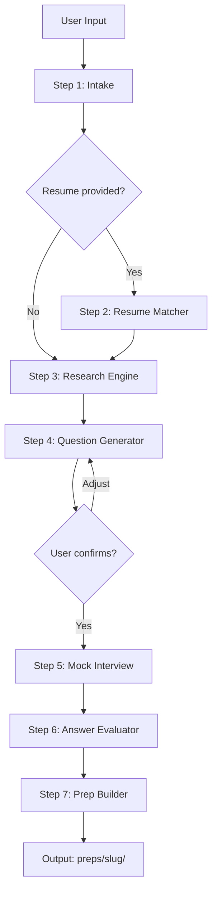
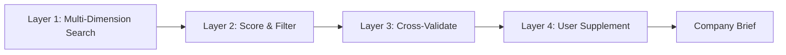

# interview-skill Architecture

> Developer-facing architecture documentation for contributors and maintainers.

---

## Overview

interview-skill is an AgentSkills-standard skill that automates interview preparation through structured research, question generation, mock interviews, and performance evaluation.

**Core differentiator**: A 4-Layer Research Engine that goes beyond simple web searches to deliver cross-validated, confidence-scored intelligence.

---

## System Architecture


## 4-Layer Research Engine

The research engine is the core innovation. Instead of a single search, it performs multi-dimensional research with statistical validation.



### Layer 1: Multi-Dimension Search (`search_strategist.md`)
Generates 10-15 targeted queries across 5 dimensions:
- Company fundamentals (size, tech stack, funding)
- Interview process (rounds, format, duration)
- Real interview questions (from Glassdoor, Blind, LeetCode)
- Company culture (values, work style)
- Recent news (hiring trends, product launches)

### Layer 2: Score & Filter (`result_evaluator.md`)
Each search result is scored on 3 axes (1-5):
- **Recency** (weight: 0.3): How recent is the data?
- **Credibility** (weight: 0.4): How trustworthy is the source?
- **Relevance** (weight: 0.3): How specific to this company/role/round?

Results scoring below 2.5 are discarded.

### Layer 3: Cross-Validate (`cross_validator.md`)
Statistical pattern recognition across multiple sources:
- Cluster similar data points
- Assign confidence labels: HIGH (>50% sources agree), MEDIUM, LOW, GAP
- Identify information gaps for user follow-up
### Layer 4: User Supplement (`user_supplement.md`)
Present findings with confidence labels. Collect insider knowledge from the user. Run targeted verification searches on user-provided intel.

### Research Degradation Strategy

| Grade | Condition | Strategy |
|-------|-----------|----------|
| A | ≥15 valid results (FAANG, etc.) | Full 4-layer analysis |
| B | 5-14 valid results (mid-size) | 3 layers, relaxed cross-validation |
| C | 1-4 valid results (startups) | JD analysis + generic frameworks + user input |
| D | 0 valid results | JD-only + generic framework, labeled "low confidence" |

---

## 5 Operating Modes

1. **Create** — Full 7-step pipeline from intake to prep output
2. **Mock** — Re-run mock interview from existing prep (`/mock {slug}`)
3. **Evolve** — Merge new intel into existing prep (`/update-prep {slug}`)
4. **Correct** — Fix errors in existing prep (triggered by user correction)
5. **Debrief** — Post-interview review with data feedback loop (`/debrief {slug}`)

---

## Directory Structure

```
interview-skill/
├── SKILL.md              # Entry point (AgentSkills YAML frontmatter)
├── prompts/              # 14 prompt templates (one per step/mode)
├── references/           # 4 reference docs (STAR framework, question bank, etc.)
├── tools/                # 7 Python tools (JD parser, scraper, analyzer, etc.)
├── preps/                # Generated prep documents (per company/role)
│   └── example_*/        # 3 example sets showing A/B/C grade research
├── evals/                # Trigger detection test cases
├── docs/                 # This file
└── [infrastructure]      # README, INSTALL, LICENSE, requirements.txt, .gitignore
```
## Tools Architecture

All tools are standalone Python scripts invoked via `Bash`. They accept CLI arguments and output JSON.

| Tool | Purpose | Key I/O |
|------|---------|---------|
| `jd_parser.py` | Parse JD from URL/text/file | `--url/--text/--file` → JSON |
| `interview_scraper.py` | Aggregate interview experiences | `--company --role` → search queries |
| `company_intel.py` | Company intelligence queries | `--company` → multi-dimension queries |
| `leetcode_tracker.py` | LeetCode frequency tracking | `--company --months` → search queries |
| `resume_analyzer.py` | Resume-JD matching | `--resume --jd` → match score JSON |
| `prep_writer.py` | CRUD for prep documents | `--action create/list/export/delete` |
| `version_manager.py` | Version backup & rollback | `--action backup/list/rollback` |

**Design principle**: Tools generate structured queries for the AI agent to execute. They are helpers, not the sole path — if a tool fails, the agent can fall back to `WebSearch` or direct `Bash` commands.

---

## Contributing

### Adding a New Data Source

1. Add source config to `SOURCES` dict in `tools/interview_scraper.py`
2. Define the query template targeting the new source
3. Test with: `python3 tools/interview_scraper.py --company Google --sources newsource --output /tmp/test.json`

### Extending the Question Bank

1. Add questions to `references/question_bank.md` following the existing format
2. Tag each question with: skill tested, company types, difficulty
3. The `question_generator.md` prompt will automatically pick from the expanded bank

### Adding a New Interview Format

1. Add the format section to `references/interview_formats.md`
2. Update `references/company_culture_tags.md` if it's company-specific
3. The `mock_interviewer.md` prompt will adapt its style accordingly

---

## License

MIT — see [LICENSE](../LICENSE) for details.